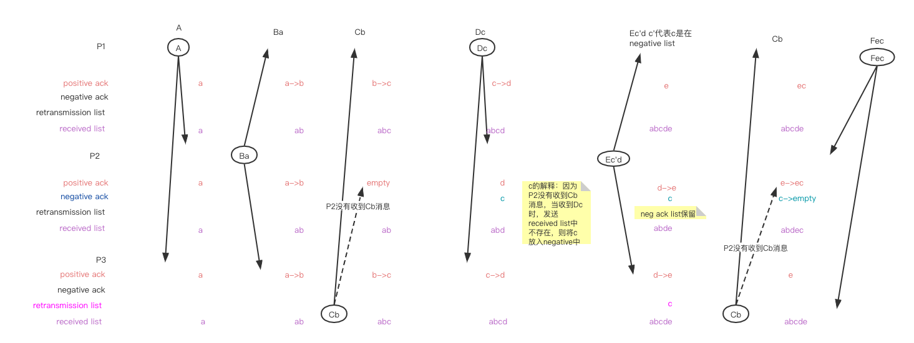

+ 论文：[Broadcast Protocols for Distributed Systems](http://citeseerx.ist.psu.edu/viewdoc/download;jsessionid=DA32EDFFF7FE22C9B1B1CE7B36D2C6EC?doi=10.1.1.121.3113&rep=rep1&type=pdf)
+ 概述：对于该论文提出Trans 和 Total 协议，没有必要细看。核心思想是：Trans协议不是全序的，当某台机器出现故障时会导致机器上消息顺序不同。而Total协议进行容错处理，即使机器出现故障也能保证机器上消息顺序相同。
	+ 消息构成：message+ack(positive+negative)
	+ 消息传递：广播的方式，接收者不会明确进行回执，回执是通过消息广播的方式进行。
+ 读这篇论文目的是：了解分布式中的广播是什么

## 序言 没有翻译

## Trans Broadcast Protocol

### 协议

Trans协议的基本观点是：广播message的回执是通过消息来广播的

+ 进程P广播消息M
+ 进程Q收到消息M
+ 进程Q下一条发送的消息N中带上对消息M的回执
+ 进程R收到进程Q的消息N，知晓进程P的消息M已经被回复，进程R就没必要回复P的消息M了；反之，进程R要回复消息Q
+ 如果进程R没有收到P的消息，那么来自Q的消息提醒R没有消息M；之后，R下一条发送的消息中会带上进程P的消息的负面回执。

### 消息结构

+ 每个消息头部是消息ID和序号。头部的其他字段有广播的目的地地址
+ 重发消息（retransmission）与原始发送信息相同

### 数据结构
每个进程都维护下列：

+ 包含正向和负向的`Acknowledgment list`：这些ack会在下次发送消息时带上
+ 进程收到的消息的接收队列 `received list`
+ 消息的暂停重发队列 `pending retransmissions list`:  上述例子中的进程R意识到没有收到进程P发送的消息M，那么就会放入该队列中???

### 发送消息

+ 当一个进程准备发送消息时，将ack列表放入消息中。
+ positive ack放入消息中并从发送者的ack列表中删除；但negative ack要保留

### 接收消息

当一个进程接收到一个消息：

+ 将消息的ID和一个postive ack 放在`ack list`中；如果ack list 的negative中，则删除；如果`retransmission list`中有，则删除
+ 如果消息中带着positive ack，那么 `positive ack list`中的 ack要删除。如果ack的消息在`received list`中不存在，那么将该ack加入到`negative ack list`中
+ 如果消息中带着negative ack，如果`received list`中已经有该消息，那么放入`retransmission list`；如果没有，那么加入到 `negative ack list`

### 重发超时 Retransmission Timeout

+ 如果一个进程长时间没有收到positive ack，那么进程会将消息放入retransmissions list中

### Pruning the Received List
+ ... 少一段 

### 举例

A Ba Cb Dc Ec'd Cb Fec  
其中c'表示的ack是negative

结合上述描述的协议内容，可以很清楚知晓算法的核心流程。 

## The Total Protocol

Total protocol的目标是 通过全序消息、每个工作进程决定相同的全序，来实现分布式的容错的共识。 

> 没看懂，大意是使用某种投票机制实现了Total Protocol.

