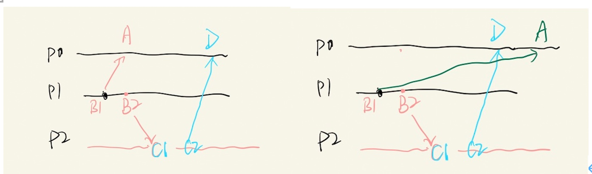

+ 论文：Time, Clocks, and the Ordering of Events in a Distributed System
+ 地址：[Time, Clocks, and the Ordering of Events in a Distributed System](https://lamport.azurewebsites.net/pubs/time-clocks.pdf)
+ 概述：本文是Leslie Lamport在1978年写的经典分布式论文，介绍分布式系统中时间、时钟、事件排序、状态机等内容。 
+ 翻译：将尝试将该文进行翻译，并对于其中的算法内容进行图文说明。 

## Abstract

分布式系统中一个事件发生在另外一个事件之前是可检查的，本文定义了事件的偏序（partial order)。 给出一个使用逻辑时钟(logical clocks) 进行同步系统的分布式算法，逻辑时钟可以用于对事件进行全排序(total order)。使用一个解决同步问题的方法来说明全序(total order)的使用。之后，详细说明了一个同步时钟的算法， 获得时钟偏差的边界

## 序言

时间(time)概念是我们思考的基础。起源于事件发生的顺序。如果事件发生在时钟3:15之后，3:16之前，那么我们说该事件发生在3:15。 我们思考系统时必然涉及事件时序(temporal ordering of event)这个概念。举例，对于一个航班预定系统，一个预定请求需要确保在航班满员之前才能生效。但是，在分布式系统中我们需要重新审视这个概念。

分布式系统由一组不同的进程组成，进程是空间隔离的，并且通过交互消息来相互通信。 一组相互连接的电脑，如ARPA net，是一个分布式系统。 将中央控制器、内存单元、输入输出看做不同进程，一台单独的电脑也可以视作分布式系统。相比单个进程，分布式系统中传输时延是不可被忽略的。

我们主要考虑的是空间分离的分布式系统。当然，我们的观点是是通用的。尤其是，单机的多进程系统面临的问题与分布式系统是相似的，因为事件发生的顺序是不可预测的。 

分布式系统中，两个事件中某一个先发生 的说法有时是不可能的。 因此，`happend before` 是系统中唯一的一种事件偏序(partial order)。

这篇paper中，我们讨论由`happened-before`定义的偏序，并给出一个算法将其扩展到所有事件的一致性的全序。这个算法提供有用的机制去实现一个分布式系统。 我们通过解决同步问题来说明算法的使用。 意外的是，当算法获得排序与用户获得排序不同时，会发生异常行为。这可以通过引入真实的、物理时钟来解决。我们描述一个简单的方法来同步时钟，并得到一个同步偏移的上限 

## 偏序 partial order

大多数人可能会说，如果事件a发生时间比时间b早，则事件a发生在事件b之前。 从时间的物理理论角度证明该定义。 但是，如果一个系统正确满足某个规范，那么从系统中观察到事件的角度，必须给到一个规范。 如果规范是考虑物理时间，那么系统必须包含真实的时钟。即使其包含真实时钟，这些时钟并不一定精准，并不一定保持最精确的物理时间。我们可以不使用物理时钟来定义`happened before`关系

我们开始更准确地定义我们的系统。 我们假设系统由一组进程构成。每个进程包含一个序列的事件。依赖于应用程序，计算机上子程序的执行可以是一个事件，单个机器指令的执行也可以是一个事件。我们假设一个进程的事件组成一个序列，如果a happens before b，那么a occurs before b. 换句话说，单一进程中一组事件是天生全序的。 

我们假设：发送或接收一条消息是进程中的一个事件。我们定义`happened-before`关系，用&rarr;表示。

定义：系统中事件集合的关系&rarr; 是满足下面三个条件的最小关系：

+ 如果a和b是同一个进程中事件，并且a的到来早于b，那么a &rarr; b 
+ 如果a是进程A发送的消息，b是进程B接收消息a，那么a &rarr; b 
+ 如果a &rarr; b 并且 b &rarr; c，那么 a &rarr; c

如果不存在 a &rarr; b 或 b &rarr; a，那么两个不同的事件a和b是并发的。

我们假设，对于任何事件a，不存在 a &rarr; a。

从"空间-时间"角度来看定义更有用，如图1所示。水平方向代表空间，垂直方向代码时间，后发生的时间高于早发生的实际。点代表事件，垂直线代表进程，波浪线代表消息。可以很容易看到 a &rarr; b 代表 从进程和消息线上移动。 例如，我们有 p1 &rarr; r4.

重要： 从另外一个角度看a&rarr;b的定义，a&rarr;b意味着事件a和b有因果关系。如果两个事件互不因果影响，那么就说明两个事件是并发的。 例子中 Figure1中事件p3和q3是并发的。

通过该定义，读者可以很自然地熟悉不变的时空关系。 在相对论中，事件的顺序是考虑可能发送的消息。但我们采用更务实的方法，只考虑确实要发送的消息。 

## 逻辑时钟 logical clocks 

我们将时钟引入系统。

## 事件全排序  ordering the events totally

我们可以使用满足Clock  Condition的时钟系统，对全部的系统事件应用全序。 我们通过他们发生的时间对事件进行排序。

.... 少了两段 ...

事件全序对实现分布式系统是非常有用的。事实上，实现逻辑时钟的正确系统的一个原因就是为了获取全序。 我们通过解决互斥锁问题来说明事件全序的使用。 考虑 一个由固定数量进程组成 并 共用单一资源的系统。只能有一个进程在访问资源，所以进程之间必须同步从而避免发生冲突。 我们必须找到一个满足下列三个条件的算法，从而保证资源安全。 

+ 已经获取资源的进程必须先释放，其他进程才能获取到资源
+ 获取资源的顺序要按照请求创建的顺序
+ 如果获取资源的进程最终都释放了，那么每个请求最终都获取到资源了。 

初始化：我们假设资源被一个进程获取。 

... 少了一段 ...

必须意识到这是一个非常重要的问题。 使用一个中心规划  的进程来确保资源按照顺序被获取，这是不可行的，除非做了很多假设。 举例，P0是中心规划进程。假设P1发送消息给P0，并发送消息给P2；P2收到消息后，发送一个消息给P0；如右图所示(译者自己绘图)，P2的请求比P1的请求先到达P0。

为了解决这个问题，我们实现一个满足IR1和IR2的时钟，并使用他们为全部事件定义全序 a &Rightarrow; b 。这为全部请求提供全序和释放操作。使用这个排序，很容易找到解决方案。只需要确保每个进程获得其他全部进程的操作即可。 

为了简化问题，我们假设 1. 发送和接收是相同顺序 2. 每个进程可以直接给其他进程发送消息。 

每个进程维护自己的 `request queue`，不会被其他进程看到。我们假设 request queue 初始时只包含一个消息 T0:P0，其中P0是获取资源的初始化进程，T0是小于任何时钟的初始值。

由下列5个规定义一个算法：

1. 为了请求资源，进程Pi发送消息 Tm:Pi 给每一个其他进程，并将消息放入其自己的request queue中，其中Tm是消息的时间戳。
2. 当进程Pj收到消息Tm:Pi 请求资源，进程Pj将其放入request queue中，并发送一个ack 消息给Pi
3. 为了释放资源，进程Pi从其request queue中移除Tm:Pi request source message，并发送一个Pi的release resource message给其他进程
4. 当Pj收到进程Pi的release resource消息时，Pj从request queue中移除Tm:Pi request resource message
5. 当满足下面两个条件时，进程Pi获得资源：
	+ request queue中的 Tm:Pi request resource 消息 比 队列中其他消息时间都靠前，时间靠前是靠 &Rightarrow; 定义的
	+ Pi收到其他进程的消息都比Tm要晚
	
	
译者注释：下面例子是[youtube](https://www.youtube.com/watch?v=r7SJOhGF4Nc)中介绍lamport mutual exclusion算法的例子。

	
问题:我们有三个进程P1-3，其中P1和P3希望获取临界区 critical section (CS)

+ 首先P3发送请求，并广播给全部其他进程；同时P3的队列中保存 (ts:1,P3)，其中ts:1是时间戳
+ 之后P1发送请求，并广播给全部其他进程。同时收到来自其他进程的ack
+ 接下来我们看一下request queue的第一个，是否已经收到其他进程的ack；如果已经收到，那么该进程就获取资源。那么队列中第一个是P3（因为ts:1 早于 ts:2）就获得临界区。
+ 再之后 P3释放资源，之后P1就可以获得临界区。
	
	
	
 这一段翻译的很有问题!!!!! 回到论文本身，很容易证明算法是满足条件I-III的。首先看一下rule5的condition(ii)，伴随着假设，消息是有序接收，保证Pi已经知晓处理当前请求的全部请求。 

这是一个分布式算法。每个进程都符合上述规则，没有中心同步进程或中心存储。这个方法可以泛化实现分布式多进程系统的任何同步。同步可以用术语 `State Machine`来详细描述，状态机由以下元素组成：

+ C：可能的命令的集合
+ S：可能的状态
+ e：函数 e: C x S &rarr; S

关系e(C,S)=S' 表示 状态S时执行命令C，状态变为S'。
在我们的例子中，集合C由全部的请求资源Pi和释放资源Pi构成；状态又等待请求的命令的队列组成，request 队列的请求是正在获取资源的那个。执行一个request命令，会在队列尾部添加一个元素。

每个进程独立模拟状态机的执行，使用全部进程发出的命令。 因为所有进程的命令殊勋是一样的，可以实现同步。

这个方法允许实现任何形式的多进程同步。但是，算法的结果需要全部进程的积极参与。一个进程必须知道其他全部进程的所有命令，因此当一个进程失败时，将不会执行状态机命令，因此阻塞整个系统。

在这篇文章中，没有针对这个问题进行讨论。

## 异常行为

考虑一个全国的分布式系统，假设一个人在电脑A上发送请求A给远端；之后打电话给B，B发送请求B给远端。可能存在请求B的时间戳小于请求A。

... 少了三段

## 物理时钟 没有翻译
